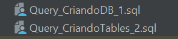
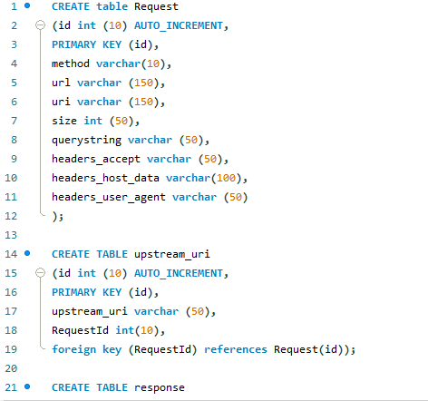
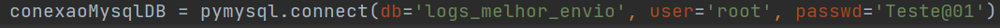
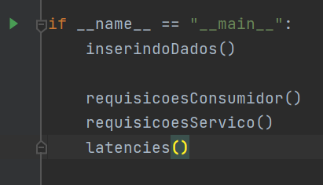
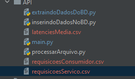

## Data Engenieer Challange

### Tecnologias

- [Python 3.8.7](https://www.python.org/downloads/release/python-387/)
- [MySQL](https://www.mysql.com/downloads/)

### Instruções

**Passo 1: Clonar o projeto**

```
https://github.com/Gabriel-RdS/AnaliseDeDadosAPI_ME.git
```

**Passo 2: Descompactar aquivo de dados e inserir logs.txt na pasta Dados**


**Passo 3: Executar querys inseridas na pasta Querys_BD no Banco de Dados MySql**

```
Usuário e senha do Banco de dados sugeridos:
user: root
senha: Teste@01
```
Na ordem abaixo:






**Passo 4 analisar a conexão do banco de dados no arquivo, inserindoDadosNoBD**



**Passo 5: Executar o programa em main.py**



```
OBS: Caso ele gere um erro quando executado, exclua o arquivo comene conforme a imagem abaixo
```


**Passo 6: Arquivos gerados**


